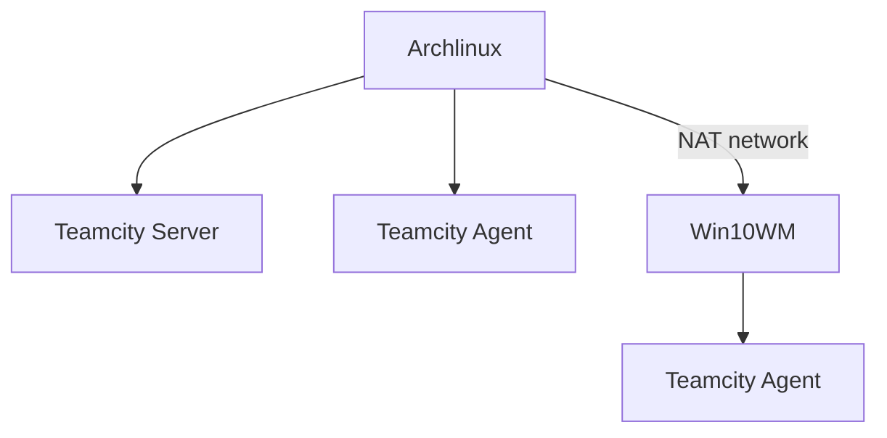

# 5.19
就差一个公网ip了

# 6.5 软件部分
其实我一直以来很头疼的就是Qt和Unity在windows下的打包. 和别人合作开发的感受吧.   
对方如果不懂git的话我这块修改了一个细节就得给人打包一次, 还是搁微信发个压缩包, 更麻烦.  
本着折腾的心情,我花了一个下午在我的老t480上面研究了一下Teamcity, 如果以后单独买一个服务器就可以直接移植过去.  

## 为什么不选Github Actions
1. Github Actions的免费额度太少了, 只能用来做一些小项目的自动化.
2. 调试非常麻烦, 需要每次都提交代码才能触发.我在本地完全可以自己逐步运行脚本,不断完善.
3. 单独有个服务器上面可以跑一些别的服务,比如直接挂一个文件让策划或者美术直接下载,支持web部署的话更能在浏览器就能看到效果.  还有私有的代码仓库啊, docker registry啊...  

## Teamcity
Teamcity是Jetbrains出品的CI/CD解决方案, 问就是颜值在线. 跟IDE的集成暂时没用上没研究.  
我在t480 archlinux上跑一个服务端,一个agent,用vmware又开了一个win10的虚拟机,里面装好了Qt和Unity.

T480 配置为i7-8650U 4Core, 32G内存, 1T SSD, 我平时跑很多程序内存的压力不大, cpu是瓶颈吧. 这么一说我真想换一个双路至强了.  

## Qt
Qt在Windows下打包我之前折腾过, 经验直接复用了.  

## Unity 
Unity的打包JetBrains有插件, 而且因为是在自己的机器上,许可证认证什么的不用像在Github Actions上面那么麻烦.

## Windows上安装buildAgent服务
用户权限相关报错: [参考](https://segmentfault.com/a/1190000023071540) ,而且用户不能是空密码.

## 从vmware迁移到kvm
卸载vmware tools, 参考[这篇](https://gist.github.com/broestls/f872872a00acee2fca02017160840624)  
[不启动虚拟机操作文件系统](https://www.cnblogs.com/oloroso/p/6385398.html)
要使用UEFI引导, 而不是默认的BIOS  
改用virtio驱动需要折腾一下,按照archwiki
## pcie拆分(没用到)
[这里](https://zhuanlan.zhihu.com/p/592154834)
